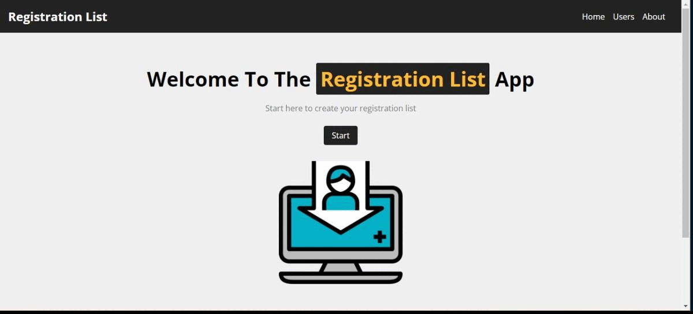

## REGISTRATION LIST FRONT END

Esse Fron-End foi criado para uma aplicação de cadastro de pessoas, com os inputs de `NOME`, `EMAIL`, `DATA DE NASCIMENTO` e quando enviados para o Back-End é retornado a IDADE da pessoa cadastrada.

## IMPORTANTE:

Para rodar aplicação é importante rodar localmente o back-end, segue o link do back end:

`https://github.com/mroenca40/registration_list_back_end_nodejs`

## RODANDO A APLICAÇÃO LOCALMENTE:

```bash
No terminal, clone o projeto em SSH:
 
$ git clone git@github.com:mroenca40/registration_list_back_end_react.git
 
Entre na pasta do projeto:
 
$ cd registration_list_back_end_react
 
Instale as dependências:
 
$ yarn
 
Execute a aplicação:
 
$ yarn run dev
 
Pronto, agora é possível acessar a aplicação Front-End a partir da rota http://localhost:3000/
```

## GIF DAS TELAS:

<p align="center">
   
</p>

## Contato
 
<a targer="_blank" href="https://www.linkedin.com/in/matheus-proenca-dev/"></a>
 
## Desenvolvedor
 
[<br><sub>Matheus Proença</sub>](https://github.com/mroenca40)
 
### Contribuições
 
Caso você queira fazer alguma contribuição, fique a vontade para comentar, fazer pull requests. Toda ajuda para melhorar o código é bem vinda! :D
 
###